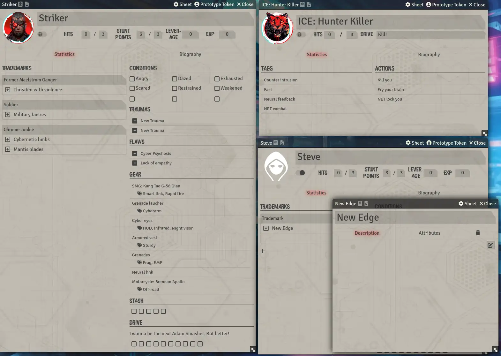
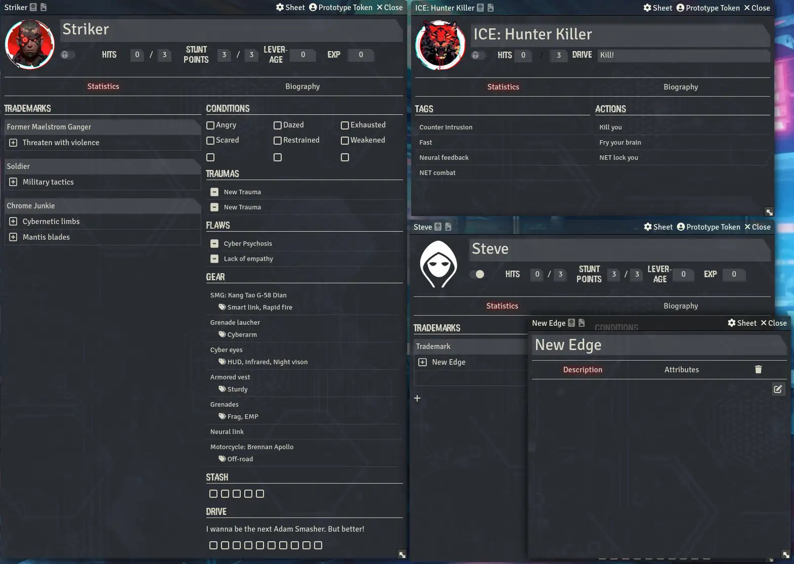

# Foundry VTT: Neon City Overdrive unofficial game system

This game system for Foundry Virtual Tabletop provides character sheet and game system support for the [Neon City Overdrive RPG by Nathan Russell](https://www.perilplanet.com/neon-city-overdrive/). This is an unofficial game system and not affiliated with Nathan Russell or Peril Planet.

This system provides character sheet support for characters and NPCs. For dice rolling you can install the [FUx Dice Roller](https://github.com/neovatar/FUx-Dice-Roller) which has support for "Neon City Overdrive/Action! Tales" type rolls.

The software component of this system is distributed under the MIT license. For a complete list of licenses for the included components, please read [LICENSE.md](LICENSE.md).

## Sheet samples

You can lock a sheet to prevent accidental edits with the lock slider next to the character image.

## Installation Instructions

To install and use the Neon City Overdrive Unofficial game system for Foundry Virtual Tabletop, simply paste the following URL into the 
**Install System** dialog on the Setup menu of the application.

`https://github.com/neovatar/neon-city-overdrive-unofficial/releases/latest/download/system.json`

If you wish to manually install the system, you must clone or extract it into the `Data/systems/neon-city-overdrive-unofficial` folder. You
may do this by cloning the repository or downloading a zip archive from the
[Releases Page](https://github.com/neovatar/neon-city-overdrive-unofficial/releases).
